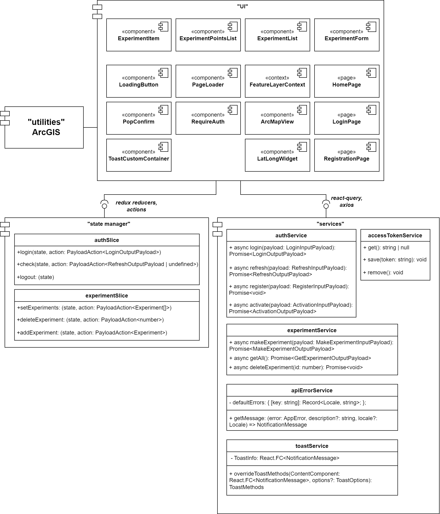
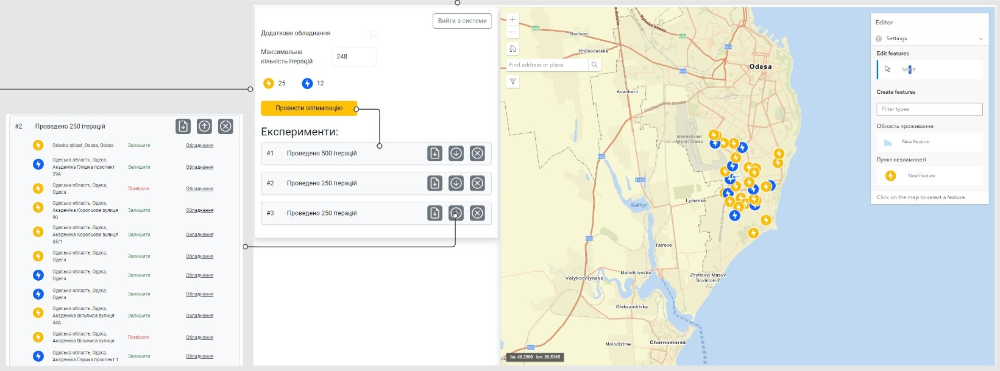
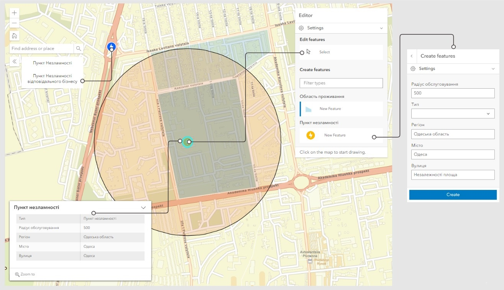
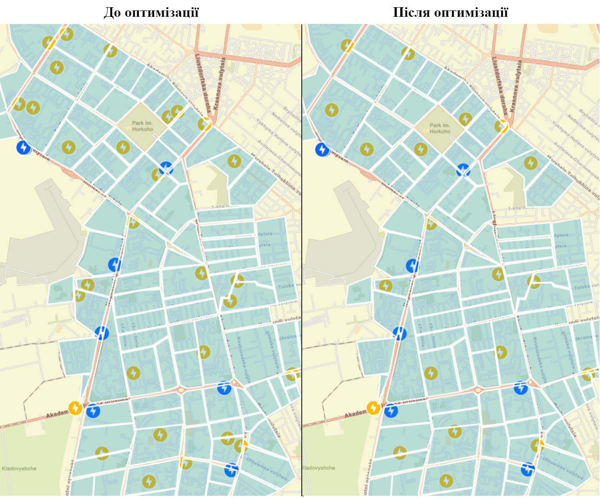

# Social Infrastructure Optimization

## Introduction

This project focuses on the optimization of the placement of social infrastructure objects through a geospatial approach. The goal is to create software that facilitates finding the optimal locations for these objects, promoting efficient resource utilization, reducing costs, and enhancing service quality.

## Objectives

- **Research Object:** Optimization of the placement of social infrastructure objects.
- **Subject:** Software development for the geospatial optimization of social infrastructure object locations.

## Materials, Methods, and Technical Tools

- **Programming Paradigm:** Object-oriented programming.
- **Programming Languages:** Python, TypeScript.
- **Development Environments:** Spyder, Visual Studio Code.
- **Geographic Information System:** ArcGIS.
- **Metaheuristic Methods:** Genetic algorithm.
- **Architectural Design Pattern:** Model-View-Controller (MVC).
- **Version Control:** Monorepository.
- **Frontend Library:** React.js.
- **Backend Environment:** Node.js.
- **Operating System:** Windows 10 with GeForce GTX 1060 graphics card.

## Results

The novelty of this work lies in the method of optimizing the placement of social infrastructure objects using a genetic algorithm. It defines stages for forming the final solution and applies a modified recovery operator.

## Conclusions

The project has successfully developed software for mapping the social infrastructure system on a real map and optimizing the placement of its objects.

## Application Area

This software finds utility in both governmental institutions and private organizations aiming to optimize the locations of socially significant facilities.

## Client-side architecture

## API Documentation

For details on utilizing the API, refer to [API Repo](https://github.com/sergey-lipikhin/social-infrastructure-api).

### Images

